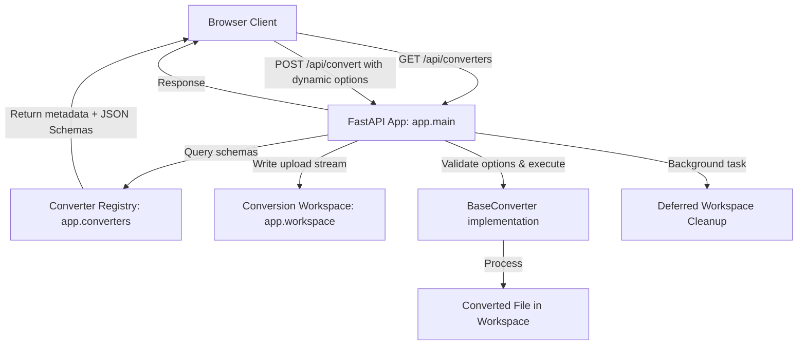

# Architecture Documentation

Adla-Badli is a modular, single-page application built on FastAPI that provides file conversion services with self-documenting converter options and sandboxed workspaces.

## System Overview

## Core Components

### 1. API Entry Point (`app/main.py`)
- Configures FastAPI routes (`/`, `/api/converters`, `/api/convert`).
- Captures dynamic option parameters from HTTP form requests.
- Validates options dynamically using converter-specific Pydantic schemas.
- Hands over temporary file creation and unlinking responsibilities to `ConversionWorkspace`.

### 2. Conversion Workspace (`app/workspace.py`)
- **ConversionWorkspace**: Context manager that handles sandboxed temporary directory creation (using unique UUIDs) and unlinking.
- Exposes `write_input_file` to write upload streams to disk.
- Exposes `release()` and `get_cleanup_task()` to defer directory deletion to FastAPI's background tasks after responses finish streaming.

### 3. Converter Architecture (`app/converters/`)
- **Base Converter (`base.py`)**: Abstract base class defining conversion interfaces and the optional `options_schema` class attribute (a Pydantic `BaseModel`).
- **Registry (`__init__.py`)**: Maps source and target extension tuples (e.g. `('svg', 'jpg')`) to converter classes. Serializes option schemas to standard JSON Schema metadata via `list_converters()`.
- **Implementations**:
  - `svg_to_jpg.py`: Converts SVG images to JPEG formats. Defines enums for background canvas color overrides.
  - `md_to_docx.py`: Converts Markdown files to DOCX using Pandoc.

## Request Life Cycle
1. File uploaded and target extension specified at `/api/convert`.
2. App parses source extension and checks Registry.
3. FastAPI parses and validates query options against the matched converter's Pydantic model (`options_schema`).
4. An isolated `ConversionWorkspace` directory is created. Upload streams are buffered to the input file path.
5. The matched converter is executed on workspace file paths using validated options.
6. The converted file is returned as a stream download response.
7. The workspace is released, and its directory is purged in a background thread.

## Frontend Architecture
- **Structure (`app/templates/index.html`)**: Semantic markup containing dropzone, target selectors, and a generic `#dynamic-options-container` div.
- **Styling (`app/static/css/style.css`)**: Glassmorphism design tokens containing custom styling variables, floating gradients, responsive grids, and form input/checkbox styles (`.option-input`, `.option-checkbox`).
- **Client Logic (`app/static/js/main.js`)**: Manages drag-and-drop actions, fetches converters metadata, dynamically builds UI input fields based on JSON Schema properties, and dynamically serializes active inputs during submission.

## Testing Architecture

### 1. Python Converter Tests (`tests/test_converters.py`)
- Unit tests for core file converters.
- Verifies Markdown to DOCX conversion and SVG to JPG conversion using sample files and Pydantic option models.

### 2. Python Workspace Tests (`tests/test_workspace.py`)
- Unit tests validating the workspace context manager, cleanup assertions, release mechanisms, and deferred background tasks.

### 3. Playwright E2E Tests (`e2e/`)
- End-to-end tests validating the web interface directly in browsers (auto-starts Uvicorn).

