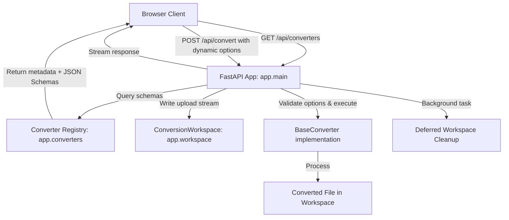

# Architecture Documentation

Adla-Badli is a modular, single-page application built on FastAPI that converts AI-friendly formats (md, txt, html, csv, json, svg) into human-readable ones (docx, pdf, xlsx, html, txt, jpg, png). The converter registry is self-documenting: each converter exposes a Pydantic options schema that the frontend renders automatically into UI controls.

## System Overview

## Core Components

### 1. API Entry Point (`app/main.py`)
- Exposes three routes: `GET /`, `GET /api/converters`, `POST /api/convert`.
- Parses the uploaded file's source extension and requested `target_ext` form field.
- Validates converter-specific options dynamically against the matched converter's Pydantic schema.
- Returns the converted file as a streaming `FileResponse`; workspace cleanup is deferred to `BackgroundTasks`.

### 2. Conversion Workspace (`app/workspace.py`)
- **`ConversionWorkspace`**: Context manager that creates a UUID-named temporary directory per conversion.
- `write_input_file(upload)` writes the FastAPI `UploadFile` stream to `input.<ext>` inside the workspace.
- `release()` disarms automatic cleanup on context exit, delegating it to `get_cleanup_task()` — a callable passed to FastAPI's background task queue so the temp directory is deleted after the response finishes streaming.

### 3. Converter Architecture (`app/converters/`)

#### Base (`base.py`)
Abstract class defining the interface all converters must implement:
- `source_extension` / `target_extension` properties (lowercase, no dot).
- `convert(input_path, output_path, options)` — raises on failure.
- Optional `options_schema` class attribute: a Pydantic `BaseModel` whose fields become UI controls in the frontend.

#### Registry (`__init__.py`)
Maps `(source_ext, target_ext)` tuples to converter classes. All three groups are registered at import time. Exposes:
- `get_converter(source, target)` — returns an instance or raises `ValueError`.
- `list_converters()` — returns every registered pair with its serialized JSON Schema (used by `GET /api/converters`).

#### Converter Groups

**`text_converters/`** (10 converters — md, txt, html sources)

| Converter | Approach |
|-----------|----------|
| md/txt/html → docx | `pypandoc.convert_file()` with the appropriate Pandoc reader/writer |
| md/txt → html | Pandoc HTML body wrapped in a standalone document with base CSS |
| html → txt | Pandoc `plain` writer |
| md/txt/html → pdf | Pandoc → HTML body → **xhtml2pdf** rendering pipeline |

`shared.py` provides: `read_source_as_html()`, `html_to_pdf_file()`, `wrap_html_document()`, `convert_via_pandoc()`, `convert_to_plain_text()`.

PDF output uses **xhtml2pdf** rather than WeasyPrint because xhtml2pdf is a pure-Python renderer with no GTK/Cairo system dependencies — important for Windows development environments. Complex CSS layouts are normalized through Pandoc before being handed to xhtml2pdf.

The `PdfOptions` schema (in `options.py`) adds a `page_size` field (a4 / letter) to all PDF converters.

**`data_converters/`** (8 converters — csv, json sources)

All paths normalize input through pandas:
- **CSV** is read with `pd.read_csv(dtype=object)` to preserve raw string values.
- **JSON** is loaded with `pd.json_normalize()` — arrays of objects, single objects, and objects wrapping arrays of objects are all handled; nested structures are flattened to dotted column names; residual complex values are JSON-stringified.

Rendering targets:
| Target | Library | Notable formatting |
|--------|---------|-------------------|
| xlsx | openpyxl | Bold header row, alabaster fill, frozen panes, auto-fit columns |
| docx | python-docx | `Table Grid` style, bold headers at 10pt, data rows at 9pt |
| pdf | ReportLab platypus | Paginated table with repeating header; auto-rotates to landscape when >6 columns |
| csv | pandas `to_csv` | UTF-8, no index |
| json | pandas `to_json` | `records` (default) or `columns` orient; pretty-printed |

`CsvToJsonOptions` exposes the `orient` parameter as a UI control.

**`image_converters/`** (3 converters — svg source)

`shared.py` provides `render_svg_to_image()` which: optionally rewrites the background `<rect>` fill in the SVG XML before parsing, runs `svglib.svg2rlg()`, rasterizes with `renderPM.drawToFile(fmt="PNG")`, and composites the result onto a solid-color canvas with Pillow (handles RGBA transparency correctly).

| Converter | Path |
|-----------|------|
| svg → jpg | `render_svg_to_image()` → `Pillow.save(JPEG, quality=95)` |
| svg → png | `render_svg_to_image()` → `Pillow.save(PNG)` |
| svg → pdf | `svglib.svg2rlg()` → `renderPDF.drawToFile()` (vector-preserving, no rasterization) |

`RasterOptions` exposes `bg_color` (white / dark / black) for jpg and png converters.

## Request Life Cycle

1. Client uploads a file and target extension to `POST /api/convert`.
2. App extracts `source_ext` from the filename and looks up the converter in the registry.
3. Converter-specific form parameters are validated against the converter's Pydantic `options_schema`.
4. A `ConversionWorkspace` directory is created; the upload stream is written to `input.<source_ext>`.
5. `converter.convert(input_path, output_path, options)` runs synchronously.
6. The output file is streamed back as `application/octet-stream` with a `Content-Disposition` attachment filename.
7. `workspace.release()` is called, and a cleanup callback is registered with `BackgroundTasks` to delete the temp directory after streaming completes.

## Frontend Architecture

**Structure (`app/templates/index.html`)**
Semantic markup with four distinct states inside the main card: dropzone prompt, file-selected detail view, converter controls, and three overlay states (loader, success, error toast). The `#dynamic-options-container` div is populated entirely by JavaScript.

**Styling (`app/static/css/style.css`)**
Implements the Warm Minimalism / Editorial Elegance design system:
- **Palette**: cream canvas (`#FAF7F2`), espresso text (`#2E2018`), muted warm gray (`#6B5A50`), terracotta accent (`#C4714A`).
- **Typography**: Cormorant Garamond (serif) for headings and the tagline; DM Sans for all functional copy. Print-style micro labels use 11px uppercase with 0.12em letter-spacing.
- **Form language**: Sharp 2px border-radius, tactile layered shadows, organic gradient separators, ambient background blobs at ≤6% opacity.
- **Motion**: Staggered `fadeUp` entrances, `cubic-bezier(0.16, 1, 0.3, 1)` on all transitions, `translateY(-1px)` button lift with snap-back on `:active`. Full `prefers-reduced-motion` bypass.

**Client Logic (`app/static/js/main.js`)**
- Fetches `/api/converters` on load and caches the full conversion list.
- On file selection: auto-detects source extension, populates the target dropdown with valid targets from the cached list.
- On target change: reads the `options_schema.properties` from the matching converter entry and dynamically renders `<select>` (enum), `<input type="number">` (integer/number), `<input type="checkbox">` (boolean), or `<input type="text">` controls — each pre-seeded with the schema's `default` value.
- On convert: serializes all dynamic option inputs into `FormData`, `POST`s to `/api/convert`, and on success creates a transient `objectURL` for the auto-download.

## Testing Architecture

### 1. Python Converter Tests (`tests/test_converters.py`)
Iterates over every entry in `_REGISTRY`, generates a fixture for the source format, runs the converter, and asserts the output exists and is non-empty. Fixtures are written to `tests/fixtures/` (gitignored); output files land in `tests/output/` (gitignored).

### 2. Python Workspace Tests (`tests/test_workspace.py`)
Unit tests for the context manager: verifies directory creation, `write_input` streaming, automatic cleanup on `__exit__`, `release()` preventing cleanup, and the deferred `get_cleanup_task()` callback.

### 3. Playwright E2E Tests (`e2e/`)
End-to-end tests driving the browser UI directly. Uvicorn is started automatically by Playwright's `globalSetup` before the suite runs.
